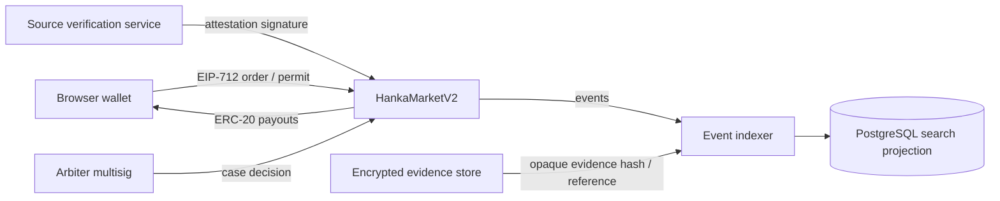

# HANKA Successor Contract: Market Flows, Gaps, and V2 Specification

**Purpose.** This document maps the current HANKA flows implemented around the deployed `HankaArcEscrow` contract, identifies the operational gaps, and proposes a successor design that can support the intended marketplace more safely. It is a product and technical specification, not a promise that social-platform actions, airdrops, or rewards can be independently verified onchain.

> **Decision in brief:** retain the current contract only for test flows. Deploy a new version for any expanded functionality. The present contract is generic and immutable; its terms hashes, wallet identities, and ERC-20 transfers cannot prove an X follow, a reputation metric, an airdrop allocation, or an X-account owner.

## 1. Present State and Boundaries

HANKA is currently built around one generic escrow contract with two primitives: a one-requester/one-taker **Bounty** and a named two-party **Point Exchange**. Readable social-proof offers, metrics, retention reports, and bans live in the application database; the contract only holds token balances and hashes. The current client uses the Arc chain configuration, a public contract address, and user-controlled browser wallets. No private key is required or appropriate in the website.

Arc is an EVM-compatible, stablecoin-native L1 where USDC is the gas token and transactions are designed for deterministic, sub-second finality. The Arc documentation still describes the current network as a testnet; test USDC has no real-world value and should not be used for production settlement. [1] [2]

| Area | What the current contract enforces | What remains application or human policy |
|---|---|---|
| Token custody | Allowed ERC-20 token transfers, amounts, lifecycle states, fees | Token metadata, user-facing price guidance, database persistence |
| Bounties | One requester, first taker, one delivery hash, requester payout or dispute | Task text, deliverables, social metrics, proof review, source-account identity |
| Social proof | Nothing social-specific; only the generic task hash and payment | Seller offers, follower/Kaito/Ethos claims, source registration, retention reports, bans |
| Airdrop agreements | Named parties, equal collateral, matching payout approvals, dispute resolution | Airdrop existence, allocation, value, eligibility, delivery, and outcome evidence |
| Governance | Owner can alter allowed tokens and fee; resolver settles a dispute | Reviewer process, evidence storage, source-account ownership checks, appeals |

## 2. Current Market Flows

### 2.1 General Bounty

The requester writes a brief, chooses a supported ERC-20 amount, acceptance deadline, delivery deadline, and terms text. The application normalizes and hashes the terms. The requester approves the token and calls `createTask`, which moves the full reward into escrow and records only the hash and lifecycle data. The first eligible external wallet calls `acceptTask`; the contract does not select a seller or validate qualifications. The taker later calls `submitTask` with a hash of delivery notes. The requester either calls `approveTask`, which pays the taker less the current protocol fee, or either party opens a dispute for the resolver to settle.

| Step | Current actor | Current protection | Remaining weakness |
|---|---|---|---|
| Create and fund | Requester | Reward is escrowed before it can be accepted | Fee can change after creation; task metadata is not atomically stored with the task |
| Accept | First taker | Contract prevents requester self-acceptance | No qualified-seller selection, acceptance bond, expiry refund, or capacity controls |
| Submit | Taker | Only accepted taker can submit a non-empty delivery hash | Hash is not evidence; it cannot prove work occurred or meets the brief |
| Release or dispute | Requester / taker / resolver | Payout is transfer-atomic; resolver can split the escrow after a dispute | No review deadline, default outcome, appeal, milestone, partial delivery, or liveness path |

### 2.2 Social-Proof Bounty and Seller Offer

The seller first signs an offchain wallet challenge and publishes a database offer: source X handle, social instrument (follow, vouch, slash, repost, comment, Space role, or HANKA points), availability, and self-declared metrics. A buyer creates a generic Bounty whose terms hash contains social requirements such as target handle, minimum metrics, and a retention period. Before the wallet sends `acceptTask`, the application checks the claimant's self-declared source values against the buyer's minima. After acceptance, the claimant's source profile is stored in the database. The generic Bounty submission and payout flow follows. Once a confirmed `approveTask` receipt is observed, the application creates a retention window. The requester can sign a private early-removal report; the configured onchain resolver wallet can review it through the application. A confirmed report records a database ban and deactivates current offers for that source.

> **Important:** the current ban is a platform restriction, not a recapture of a completed payout. Once the generic contract has paid the seller, it retains no seller collateral and cannot economically penalize a later unfollow or deleted post.

| Step | Current actor | What works | Main gap |
|---|---|---|---|
| Publish source offer | Seller wallet | Wallet proves control of the wallet submitting the offer | It does **not** prove control of the X handle or metric accuracy |
| Buyer-funded request | Buyer wallet | Terms hash binds the declared request | It does not reserve or select an offer; availability is not escrowed inventory |
| Claim check | Seller wallet + application | App rejects stated metrics below the buyer's minimum | A claimant can still self-declare inaccurate metrics or a different source identity |
| Delivery / payout | Buyer and seller | Generic escrow handles the payment safely | No social-action proof is evaluated by the contract |
| Retention | App + resolver wallet | Paid-only window, evidence reference, resolver-gated ban | Database transaction after payout can fail; no bond remains to compensate buyer if removal is confirmed |

### 2.3 Airdrop / Point Agreement

The maker selects a named counterparty, locks equal collateral with terms hash, acceptance deadline, and settlement deadline. The counterparty accepts and deposits the same amount. Both then separately submit the same settlement hash and payout split. When the hashes match, the contract pays the agreed split and deducts the fee. The maker may voluntarily decline, which pays both deposits less a fee to the counterparty. Either participant may dispute, allowing the resolver to settle the fixed escrow balance.

The current mechanism is correctly closer to a bilateral contingency agreement than a token sale. It cannot prove whether an airdrop happens, who is eligible, an offchain points balance, a future token value, or whether a wallet transferred a claimed asset elsewhere.

| Step | Current actor | What works | Main gap |
|---|---|---|---|
| Offer and fund | Maker | Named counterparty and equal collateral are onchain | No standardized outcome definition or participant-readable typed signature |
| Accept and fund | Counterparty | Both deposits are held before settlement | Taker no-show and post-deadline funds need explicit liveness / expiry routes |
| Match settlement | Both parties | Matching settlement commitment prevents a unilateral arbitrary split | Parties must coordinate manually; no signed offchain settlement relay or preset default policy |
| Default / dispute | Maker / resolver | Maker’s voluntary decline has a fixed consequence; resolver can settle disputed balances | The contract has no verifiable airdrop oracle and no bounded resolver service-level agreement or appeal framework |

## 3. Inefficiencies and Material Missing Ideas

| Priority | Gap or inefficiency | Why it matters | V2 response |
|---|---|---|---|
| Critical | **No retention collateral.** Payout completes before retention begins. | A later source ban is reputational only; the buyer cannot receive an economic remedy. | Require seller retention bond for social proof; hold it until expiry or case resolution. |
| Critical | **Social identity is self-declared.** A wallet signature is not an X-account proof. | Bad actors can list handles they do not control or overstate follower/reputation values. | Add an attested source-identity registry, with explicit verification level and expiry. Do not call self-declarations “verified.” |
| Critical | **Offchain/onchain operations are not atomic.** Social metadata and retention records are database writes after transactions. | A successful payment may exist without readable metadata or retention record if the database is unavailable. | Make the contract emit complete identifier events; index them reliably. Make offchain writes idempotent and reconcile from events. |
| High | **Fee is not snapshotted.** The current payout calculates the fee when money leaves escrow. | An administrator’s later fee change affects an already-funded deal. | Store `feeBpsSnapshot` and `feeRecipientSnapshot` per listing at creation. |
| High | **Liveness is incomplete.** Some expired or inactive flows require a dispute instead of a clear expiry outcome. | Funds can sit in escrow when a participant disappears. | Add explicit `expire`, `timeoutClaim`, `timeoutReview`, and `withdrawExpired` paths with outcomes fixed when the listing is created. |
| High | **Seller offers are not reservable inventory.** Buyers cannot select, lock, or consume one named offer. | Availability can be duplicated and multiple buyers can believe they purchased the same source capacity. | Give each offer an ID, max units, remaining units, expiry, reserved target, and explicit cancellation. |
| High | **One action per source/target is only wording.** It is not a contract invariant. | A source could sell the same one-time action repeatedly to the same target. | Register `sourceIdentityHash + targetIdentityHash + instrument` and reject duplicate active/settled usage under the chosen policy. |
| High | **Resolver power is centralized and process-light.** | A resolver may be trusted operationally but there is no transparent case timer, limited remedy, or appeal. | Use separate roles, case states, evidence hashes, fixed remedies, time bounds, and a multisig arbitration role for high-value cases. |
| Medium | **No milestone / partial payout support.** | General tasks and Space participation can have staged delivery. | Support milestone arrays, optional claimant bond, and explicit per-milestone approval/dispute. |
| Medium | **Two-step approve then action friction.** | Users must approve ERC-20 and then submit a second transaction. | Where token support and audit scope permit, support EIP-2612 permit or a carefully reviewed permit flow. Do not force unlimited approvals. |
| Medium | **Bounded ID scanning does not scale.** The client scans at most 300 records. | Records eventually disappear from the dashboard view and RPC reads become expensive. | Build an event indexer and database projection; use events as the source for search and pagination, while the contract stays custody truth. |
| Medium | **Evidence has no durable privacy model.** | Evidence cannot be public onchain, yet reviewers need controlled access. | Store encrypted evidence externally, expose only `evidenceHash`/opaque reference onchain, and gate retrieval to case participants and reviewers. |
| Medium | **Airdrop agreements lack outcome schemas.** | “Airdrop value” is inherently ambiguous and invites disputes. | Offer explicit agreement templates: `MutualSettlement`, `FixedDefault`, or `ArbitratedOutcome`. Never imply a price oracle unless an auditable oracle is deliberately integrated. |

## 4. Recommended Successor Architecture

### 4.1 Product Decision: One V2 Protocol, Three Typed Market Types

Deploy a versioned **HankaMarketV2** protocol rather than stretching the immutable generic contract. The protocol should have one shared ERC-20 custody and fee engine, but store distinct typed records for `BOUNTY`, `SOCIAL_PROOF`, and `BILATERAL_AGREEMENT`. This keeps the wallet and dashboard experience unified while avoiding vague fields that become unauditable.

The V2 contract should commit to compact hashes and fixed economic parameters, not raw X handles, social metrics, or private evidence. Those details should live in an event-indexed application database. Structured EIP-712 signatures should replace opaque signing prompts for offers, acceptance, settlement, and attestations. EIP-712 includes a domain separator designed to bind signatures to a chain and verifying contract, but it **does not itself provide replay protection**; V2 must include nonces, expiries, and consumed-order state. [5]

### 4.2 V2 Roles and Governance

Use a project-controlled multisig as the default administrator, not one personal wallet. Separate the permissions below. Role changes and fee-policy changes should be timelocked and visible through events. OpenZeppelin recommends least-privilege role separation and notes that delayed, two-step administration improves protection against administrative misuse. [3]

| Role | May do | Must not do |
|---|---|---|
| `DEFAULT_ADMIN` (2-of-3 or stronger multisig) | Manage role admins and emergency policy | Directly seize escrow or resolve routine disputes |
| `FEE_MANAGER` (timelocked) | Configure future listing fee caps / token policy | Alter fee snapshots of existing listings |
| `PAUSER` (guardian) | Pause new listings and new acceptances during an incident | Move customer funds or resolve cases |
| `ARBITER` (multisig or qualified panel) | Resolve explicitly opened disputes and social-retention cases | Change terms, identity data, or fees after a listing begins |
| `ATTESTER` | Attest source-wallet binding and verification level with expiry | Move escrow or decide cases |
| Users | Create, accept, submit, settle, cancel, or dispute their own listings | Grant roles or alter other users’ records |

The contract should include `Pausable`, `ReentrancyGuard`, `SafeERC20`, explicit custom errors, checks-effects-interactions ordering, and a withdrawal/accounting invariant. Pausing is an emergency response mechanism; reentrancy protection protects sensitive transfer paths. [4]

### 4.3 Common V2 Record Fields

All market records should snapshot the economic rules at creation.

| Field | Purpose |
|---|---|
| `id`, `marketType`, `creator`, `counterparty` | Immutable market identity and allowed actor(s) |
| `token`, `grossEscrow`, `feeBpsSnapshot`, `feeRecipientSnapshot` | Exact custody and fee accounting |
| `termsHash`, `metadataHash`, `termsVersion` | Durable commitment to readable offchain terms and schema |
| `acceptBy`, `dueAt`, `reviewBy`, `expiryAt` | Explicit liveness / timeout stages |
| `policyFlags` | Chosen default policy, e.g. auto-refund, auto-release, no-show outcome |
| `nonce`, `signatureExpiry` | Prevent replay of signed orders / relayed actions |
| `status` | A narrow, auditable state machine with terminal states |

## 5. V2 Market Specifications

### 5.1 Bounty V2

**Purpose:** requester-funded work with open or preselected claimant, clear deliverables, and safe liveness paths.

| Function group | Required behavior |
|---|---|
| `createBounty` | Deposit exact ERC-20 amount; snapshot fee; emit `BountyCreated` with `termsHash`, `metadataHash`, and deadlines. Support optional `assignedTaker`. |
| `acceptBounty` | Permit only the assigned taker or the first eligible taker. Optionally take an explicitly disclosed acceptance bond. |
| `submitMilestone` / `submitDelivery` | Commit an evidence hash and optional encrypted-evidence reference hash. Do not put raw private evidence onchain. |
| `approve` / `approveMilestone` | Pay only the precomputed share. Never recalculate historical fees. |
| `openDispute` / `resolveDispute` | Freeze only the disputed record; resolver can distribute only that record’s remaining balance. |
| `expireUnaccepted`, `timeoutDelivery`, `timeoutReview` | Unlock funds according to the requester-selected default policy declared at creation. |

Recommended initial scope is a single delivery plus optional claimant bond. Add multi-milestone work only after the base state machine and accounting are audited.

### 5.2 Social Proof V2

**Purpose:** support a source account’s follow, vouch, slash, repost, comment, or Space participation, while making retention economically meaningful without pretending a contract reads X data.

#### A. Source identity registry

1. A seller connects a wallet and asks to register a source identity.
2. A verification service checks a time-bound proof of control using the chosen policy: a platform-authorized connection, a visible nonce post, or manual review. The resulting assurance level must be displayed as `self-declared`, `manual review`, or `platform-authorized`—never silently upgraded.
3. The service signs an EIP-712 `SourceAttestation` containing the seller wallet, `sourceIdentityHash`, verification level, metric snapshot hash, issued time, and expiry.
4. The contract stores or validates the attestation signature and rejects expired or revoked attestations for new social listings.

The public source handle may remain offchain. A hash does not make a short public handle secret, so it should be treated as a lookup commitment, not privacy protection.

#### B. Reservable offer

`createSocialOffer` should create a specific offer ID with: source-identity commitment, instrument, capacity, remaining capacity, per-target duplicate policy, offer expiry, fee snapshot, and metadata hash. A buyer can either fund an open social Bounty or reserve one named offer. A reservation increments capacity only once escrow is received, preventing double-selling.

#### C. Retention bond and case flow

The seller must put a disclosed **retention bond** into escrow when accepting a social-proof task. The requester deposits the reward; the contract holds the seller’s bond separately. At ordinary approval, it releases the immediate seller reward but keeps the bond until `retentionEndsAt`. A verified, confirmed early-removal case transfers the bond according to the precommitted rule; a dismissed case leaves it locked until the normal release date. At expiry, anyone can call `releaseRetentionBond` to eliminate reliance on the seller returning.

| State | Permitted action | Economic result |
|---|---|---|
| `Funded` | Buyer creates request or reserves offer | Reward held; no seller bond yet |
| `Accepted` | Verified seller accepts and posts bond | Reward and bond held separately |
| `Delivered` | Seller commits evidence | Review clock begins |
| `PaidWithRetention` | Buyer approves | Immediate payout released; bond remains held |
| `RetentionCaseOpen` | Buyer posts `evidenceHash` and optional case bond before expiry | Bond remains frozen; raw evidence stays private |
| `RetentionConfirmed` | Arbiter confirms | Bond pays buyer or a fixed split; source status is restricted for future offers |
| `RetentionDismissed` | Arbiter dismisses | Seller’s bond remains until expiry; requester case bond follows predefined policy |
| `RetentionReleased` | Expiry reached without confirmed case | Bond pays seller |

This is the critical change missing from the current flow. It creates a bounded, disclosed remedy without claiming that a ban can reverse a completed payout. The protocol can ban a **verified source identity** from new HANKA listings, but it cannot make X itself enforce a follow or prevent an account outside HANKA from acting.

### 5.3 Bilateral Airdrop / Point Agreement V2

**Purpose:** a clearly disclosed equal-collateral contingency agreement between two named wallets—not an oracle-priced token sale.

V2 should require a standard `AgreementTerms` commitment that spells out the exact contingency, evidence source, settlement deadline, default consequence, and whether the agreement is `MutualSettlement` or `Arbitrated`. Both participants should sign the same EIP-712 terms before or during funding. The contract should never derive token price or airdrop value from vague text.

| Function group | Required behavior |
|---|---|
| `createAgreement` | Maker deposits collateral and publishes named counterparty, terms hash, default policy, fee snapshot, acceptance and settlement deadlines. |
| `acceptAgreement` | Counterparty signs the same typed terms and deposits exact matching collateral. |
| `submitMutualSettlement` | Either party can relay both nonces/typed signatures; matching signatures settle one pre-agreed split without two manual transactions. |
| `declareVoluntaryDefault` | A party may invoke the fixed, pre-agreed default outcome; the contract does not value an airdrop. |
| `timeoutAgreement` | After deadline, anyone executes the pre-committed refund/default rule. No dormant escrow. |
| `openDispute` / `resolveAgreement` | For subjective or contested outcomes only; resolution is constrained to that escrow’s remaining balance. |

For the first V2 release, limit agreements to equal ERC-20 collateral and mutual settlement. If the outcome depends on an actual token allocation or price, require a clearly defined external adjudication policy rather than pretending a contract can observe it.

## 6. Offchain Systems That Must Accompany V2

The contract alone is not the entire market. Build these before presenting V2 as a fuller marketplace.

| Service | Responsibility | Security / reliability requirement |
|---|---|---|
| Event indexer | Persist `Created`, `Accepted`, `Submitted`, `Paid`, `CaseOpened`, `Resolved`, and `Expired` events | Rebuildable from the chain; idempotent; cursor stored durably; no 300-record scan |
| Source attestation service | Issue/ revoke short-lived source-wallet verification attestations | Separate signing key; HSM/secure wallet process; audit log; signer never resides in browser code |
| Evidence service | Encrypt and access-control screenshots, links, and review material | Store only opaque hashes/references onchain; release evidence access to parties/reviewers only |
| Case operations | Apply published review SLA, evidence standard, conflict policy, and appeals | Multisig confirmation for high-value cases; no silent, unilateral edits |
| Risk controls | Rate limits, duplicate target checks, offer inventory checks, fraud reporting | Platform policy only; must not be labelled as an onchain guarantee |

## 7. What Not to Put in V2

Do **not** add a price oracle for speculative airdrop values in V2. It would introduce a far larger trust and manipulation surface without solving uncertain eligibility. Do **not** put raw X handles, screenshots, private links, Kaito/Ethos numbers, or evidence files onchain. Do **not** use a global handle ban without verified source ownership, seller-wallet scope, appeal procedure, and expiry/review policy. Do **not** use unlimited ERC-20 approvals, project server private keys, or a personal EOA as the sole administrator.

## 8. Deployment Plan and Release Gates

The recommended order is to approve this product policy first, then implement the V2 state machines, then deploy to Arc testnet. Arc’s official guidance uses standard Solidity tooling, recommends keeping keys outside version control, and supports contract verification via the ArcScan Blockscout endpoint. [1] Arc’s testnet may have instability; keep testnet tokens separate from any production launch decision. [1]

| Gate | Deliverable | Exit condition |
|---|---|---|
| 1. Policy approval | Retention-bond percentage/cap, case bond, default outcomes, fee policy, identity assurance levels, appeal rules | Written choice for every economic/default branch |
| 2. Specification | ABI, state-transition diagrams, event schema, typed-data schema, database/indexer model | No ambiguous state, payout, or deadline behavior remains |
| 3. Implementation | Versioned Solidity V2 plus frontend adapter and event indexer | Unit, integration, fuzz, and invariant tests cover every custody state |
| 4. Independent review | Security audit and remediation report | No unresolved high/critical custody, authorization, or replay findings |
| 5. Testnet pilot | Small, invite-only workflow with faucet tokens | Reconciliation matches contract events; timeout and dispute paths exercised |
| 6. Production readiness | Multisig roles, monitoring, runbooks, incident pause procedure, verified contract | Separate user approval before any real-value deployment |

### Suggested V2 acceptance tests

1. Fees are exactly snapshotted per record and cannot change after creation.
2. No money can become permanently locked after each deadline path.
3. A social seller cannot reserve/fulfil two active one-time actions for the same verified source, target, and instrument where policy prohibits it.
4. A retention bond can only release to seller after expiry or move under the fixed confirmed-case result.
5. An arbiter cannot transfer money outside the specific disputed record.
6. Every EIP-712 authorization is bound to chain ID, contract, nonce, deadline, and intended action; replay fails.
7. A paused protocol prevents new risk while preserving permitted safe exits/refunds.
8. The indexer can rebuild all dashboard rows from contract events and arrives at the same escrow balances.

## 9. Decisions Needed From You Before Coding V2

| Decision | Recommended starting choice |
|---|---|
| Social seller retention bond | Start at a fixed 20–30% of reward, capped by a modest maximum, and expose it before acceptance. Final value is a product policy decision. |
| Buyer case bond | Small fixed amount or percentage returned if confirmed; paid to seller if dismissed. This deters frivolous reports. |
| Retention length | 7, 14, 30, 60, or 90 days, selected by buyer and displayed before seller acceptance. |
| Source verification levels | `self-declared`, `manual review`, and later `platform-authorized`; no ambiguous “verified” label. |
| Governance | 2-of-3 multisig for admin and arbitration; separate guardian pause wallet. |
| Supported token at first | One audited, supported ERC-20 settlement asset before adding EURC/cirBTC. |
| Airdrop agreement V2 | Equal-collateral, named counterparties, fixed default rule, mutual typed settlement, arbitration only on dispute. |
| Upgrade strategy | Prefer versioned new deployments/factory entries for custody modules. If proxies are chosen, put upgrades behind a timelock and audit that governance path separately. |

## References

[1]: https://docs.arc.io/arc/tutorials/deploy-on-arc "Arc Docs — Deploy on Arc"
[2]: https://docs.arc.io/arc-chain "Arc Docs — Arc Network"
[3]: https://docs.openzeppelin.com/contracts/5.x/access-control "OpenZeppelin Contracts — Access Control"
[4]: https://docs.openzeppelin.com/contracts/5.x/api/utils "OpenZeppelin Contracts — Pausable and ReentrancyGuard"
[5]: https://eips.ethereum.org/EIPS/eip-712 "EIP-712 — Typed Structured Data Hashing and Signing"
